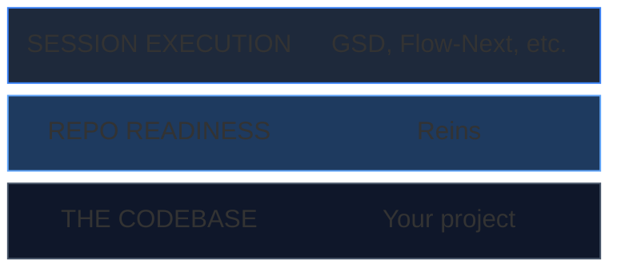
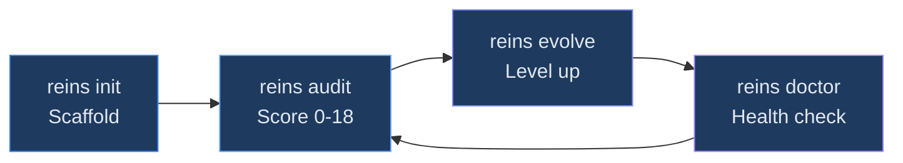
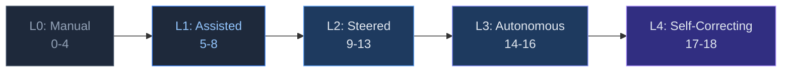
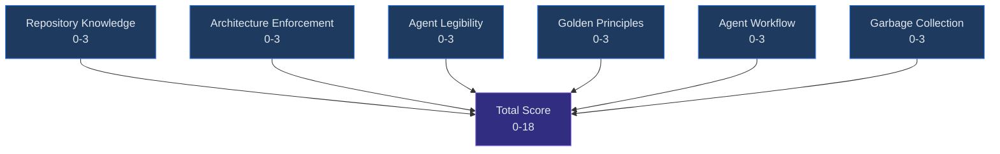

# reins

[](https://www.npmjs.com/package/reins-cli)
[](https://github.com/WellDunDun/reins/actions)
[](https://opensource.org/licenses/MIT)

[](https://www.npmjs.com/package/reins-cli)
[](https://nodejs.org/)
[](https://bun.sh/)

The open-source toolkit for [Harness Engineering](https://openai.com/index/harness-engineering/) — OpenAI's methodology for building software where **humans steer and agents execute**.

OpenAI published the methodology. We built the tooling.

## Quick start

**1. Install the skill** so your agent knows how to use Reins:

```bash
npx skills add WellDunDun/reins
```

The skill teaches your agent when and how to run every Reins command — command priority (local source vs. npx), JSON output parsing, and when to pair `audit` with `doctor` for remediation detail. Once installed, you talk:

```text
You:   "Audit this codebase and show me the weakest dimensions"
Agent: runs reins audit, parses JSON, summarizes gaps

You:   "Scaffold harness engineering in this repo"
Agent: runs reins init, then walks you through customization

You:   "Evolve to the next maturity level"
Agent: runs audit, identifies current level, executes the evolution path
```

**2. Or run the CLI directly** for a quick score without the skill:

```bash
npx reins-cli audit .
```

```json
{
  "total_score": 6,
  "max_score": 18,
  "maturity_level": "L1: Assisted",
  "recommendations": [
    "Create ARCHITECTURE.md with domain map and layer rules",
    "Add linter configuration to enforce architectural constraints",
    "Create docs/golden-principles.md with mechanical taste rules"
  ]
}
```

## Why teams adopt Reins

Most agent rollouts fail for one boring reason: agents can edit code, but the repository doesn't teach them how to reason safely.

Reins gives you a repeatable operating system for agent work:
- **A map** (`AGENTS.md`, architecture docs, indexed decisions)
- **A score** (0-18 maturity audit with concrete gaps)
- **A plan** (next-step evolution path by maturity level)
- **A guardrail model** (`risk-policy.json` + CI enforcement signals)

## Where Reins fits

Agent-first development has multiple layers. Reins operates at the **repository structure layer** — complementary to session orchestration tools, not competing with them.



| Concern | Reins | Session orchestrators |
|---------|-------|----------------------|
| When you use it | Once per repo, then evolve periodically | Every coding session |
| What it produces | Docs, audit scores, maturity roadmaps | Working code |
| What it prevents | Organizational rot, undocumented architecture | Context rot, wasted tokens |

**Use them together.** Reins scaffolds your repo so `AGENTS.md` tells the agent where everything is, `ARCHITECTURE.md` defines the rules, and golden principles are enforced in CI. Then a session orchestrator runs the actual coding work on top of that well-structured repo.

## The four commands



```bash
reins init .           # Scaffold the full structure
reins audit .          # Score against harness principles (0-18)
reins evolve .         # Roadmap to next maturity level
reins doctor .         # Health check with prescriptive fixes
```

## The maturity model

Every repo sits on a maturity spectrum. The audit tells you where you are. The evolve command tells you what to do next.



| Score | Level | What it means |
|-------|-------|---------------|
| 0-4 | **L0: Manual** | Traditional engineering, no agent infra |
| 5-8 | **L1: Assisted** | Agents help, humans still write code |
| 9-13 | **L2: Steered** | Humans steer, agents execute most code |
| 14-16 | **L3: Autonomous** | Agents handle full lifecycle |
| 17-18 | **L4: Self-Correcting** | System maintains and improves itself |

## What `reins init` scaffolds

```
AGENTS.md                        # Concise map (~100 lines) for agents
ARCHITECTURE.md                  # Domain map, layer rules, dependency direction
risk-policy.json                 # Risk tiers + docs drift rules (policy-as-code)
docs/
  golden-principles.md           # Mechanical taste rules enforced in CI
  design-docs/
    index.md                     # Design doc registry with verification status
    core-beliefs.md              # Agent-first operating principles
  product-specs/
    index.md                     # Product spec registry
  exec-plans/
    active/                      # Currently executing plans
    completed/                   # Historical plans with outcomes
    tech-debt-tracker.md         # Known debt with priority and ownership
  references/                    # External LLM-friendly reference docs
  generated/                     # Auto-generated docs (schema, API specs)
```

## The six audit dimensions

Each scored 0-3, totaling 0-18:



| Dimension | What it checks |
|-----------|---------------|
| **Repository Knowledge** | AGENTS.md, docs/, versioned execution plans |
| **Architecture Enforcement** | ARCHITECTURE.md, dependency rules, linters, policy signals |
| **Agent Legibility** | Bootable app, observability (or CLI diagnosability), lean dependencies |
| **Golden Principles** | Documented taste rules, CI gate depth, cleanup process |
| **Agent Workflow** | Agent config, risk policy, PR templates, CI enforcement |
| **Garbage Collection** | Debt tracking, doc-gardening, quality grades, docs drift rules |

## Self-apply: 18/18

Reins audits itself in CI. Current score:

```json
{
  "total_score": 18,
  "max_score": 18,
  "maturity_level": "L4: Self-Correcting"
}
```

CI gates: `lint`, `test`, `typecheck`, self-`audit`. Merging to `master` auto-publishes to npm with a patch version bump and creates a GitHub Release.
For CLI repositories, Reins treats strong diagnosability signals (for example `doctor` surfaces, CLI diagnostics in CI, and help/error coverage) as the equivalent of service observability infrastructure.

## Project structure

```
reins/
  cli/reins/            # The CLI tool (Bun + TypeScript, zero deps)
    src/index.ts        # Single-file CLI
    package.json
  skill/                # Agent skill (Claude Code)
    Reins/
      SKILL.md          # Skill definition and routing
      HarnessMethodology.md  # Full methodology reference
      Workflows/
        Scaffold.md     # Scaffold workflow
        Audit.md        # Audit workflow
        Evolve.md       # Evolve workflow
```

## Requirements

- [Bun](https://bun.sh/) v1.0+ or Node.js 18+
- No other dependencies

## Contributing

See [CONTRIBUTING.md](CONTRIBUTING.md) for guidelines.

## Methodology

Based on OpenAI's [Harness Engineering](https://openai.com/index/harness-engineering/) (February 2026, Ryan Lopopolo). The five pillars:

1. **Repository as system of record** — all knowledge versioned in-repo
2. **Layered domain architecture** — strict layer ordering with forward-only dependencies
3. **Agent legibility** — optimize for agent understanding, not just human readability
4. **Golden principles** — encode human taste mechanically, enforce in CI
5. **Garbage collection** — background agents clean drift continuously

## License

[MIT](LICENSE)
